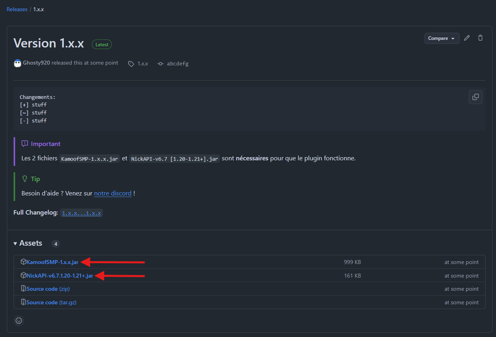
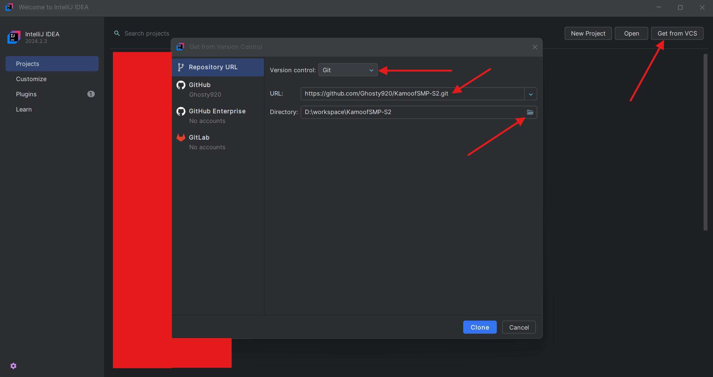
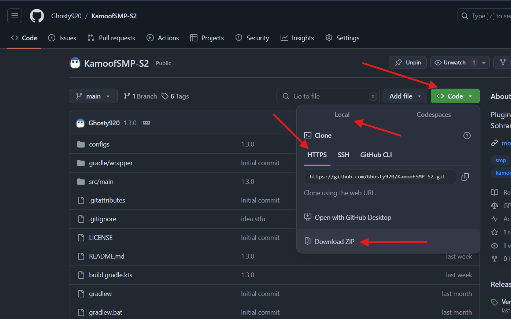

# KamoofSMP Saison 2

<div align="center">

[](https://papermc.io)
[](https://purpurmc.org)

[](https://modrinth.com/plugin/camouf2)
[](https://ghosty.im/discord?from=camouf2_github)

</div>
<br>

Plugin *non officiel, mais identique/meilleur* recréé à partir des vidéos et lives du KamoofSMP Saison 2, pour la version 1.21 de Minecraft.

Lorsqu'un joueur meurt, il fait tomber sa tête, qui, quand utilisée permet au joueur de voler son apparence et son nom temporairement. En plus de ça, avec 9 têtes il est possible de faire un rituel donnant accès à 2 pactes ayant leur avantage et désavantage opposés.


## Installation

1. Ayez un serveur [Paper](https://papermc.io/downloads/paper) (Spigot ou n'importe quel fork)
2. [Téléchargez le fichier .jar de la dernière version disponible](https://github.com/Ghosty920/KamoofSMP-S2/releases/latest)



3. Placez le fichier dans le dossier `plugins` directement dans votre serveur.
4. (Re) Démarrez votre serveur.
5. Vérifiez la console et faites `/plugins` pour voir s'il n'y a aucune erreur, sinon vérifiez l'étape 3


## Modifier
```https://github.com/Ghosty920/KamoofSMP-S2.git```

### Pour ouvrir dans Intellij Idea


### Pour ouvrir n'importe où d'autre


Et ensuite extrayez le contenu où vous voulez, et ouvrez-le dans votre IDE comme à votre habitude.

### Compiler

Utiliser la commande `gradlew shadowJar` 

## Utiliser l'API

L'API est disponible sur [JitPack](https://jitpack.io/#Ghosty920/KamoofSMP-S2/).

Les classes sont accessibles sur [GitHub](https://github.com/Ghosty920/KamoofSMP-S2/tree/main/API/src/main/java/im/ghosty/kamoof/api), par exemple.

Si vous avez un problème avec l'API, venez sur mon discord.

## Contribuer

Merci de **Reformater** votre code avec de mettre toute contribution.

Une fois tout terminé et **testé**, [ouvrez un pull request](https://github.com/Ghosty920/KamoofSMP-S2/compare).

N'hésitez pas à venir nous voir sur Discord pour toute question.
